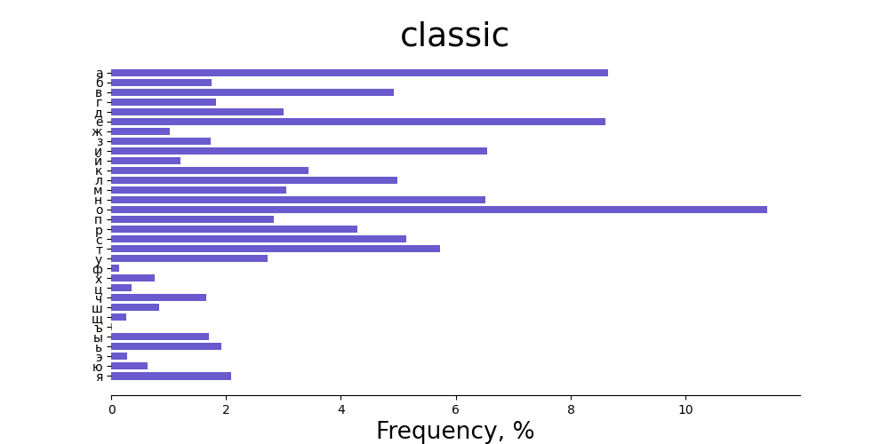
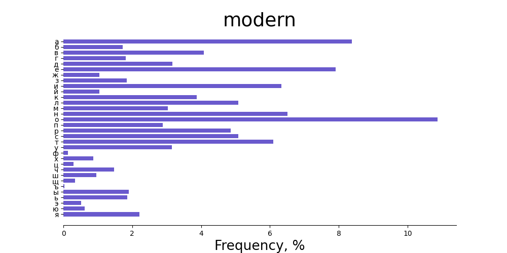

# Російські письменники

У цій вправі було порівняно частоту вживання російских літер у творах класичних російських митців (Пушкіна, Лермонтова, Гоголя та ін.) та сучасних письменників.

**Як це працює**

Для запуску проекту необхідно виконати команду
```shell
./run.sh
```
Після цього для файлів, розташованих у директорії "data" у директорії "output" будуть згенеровані діаграми, які відображають часткову частоту використання літер російського алфавіту для кожного твору та для групи творів відповідно до розташeвання у директорії "data"

**Результати**

Для класичної та новітньої літератури були отримані наступні результати: 




Суттєво застосування літер не змінилося, проте можна висунути наступні ідеї:
1. Літера 'є' стала вживатися частіше через застосування слів, запозичених з англійської та новітнього лексикону ("телеэкран", "экс-супруга", "электричка")
2. Дещо збільшилася доля шиплячих - 'ш', 'щ'
3. Порівняно з іншими, значно виросло застосування літери 'р'. Це може бути пов'язано окрім іншого з новими літературними підходами, для захоплення читачів ("Вдруг", "Современный", "Броситься", "Ракеты", "Смерть")

**Про автора**

Студент групи ІПЗм-21-1
Харківського національного університету радіолектроніки
Булгаков Антон Олегович